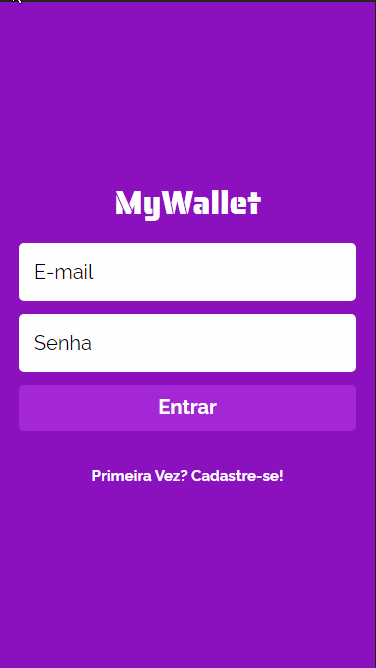

# My Wallet

An easy to use financial manager. Track your revenues and expenses to learn how you spend your money and know all the time how much you have.



Try it out now at https://link-to-my-project-deployed.herokuapp.com

## About

This is an web application with which lots of people can manage their own expenses and revenues. Below are the implemented features:

- Sign Up
- Login
- Logout
- List all financial events for a user
- Add expense
- Add revenue

By using this app any user can learn how they've been using their money and always keep track of your balance.

## Technologies

The following tools and frameworks were used in the construction of the project:<br>

<p>
  
  
  
  
  
  
  
  
</p>

## How to run

1. You need install the mongodb (follow the instructions below).
   <details>
   <summary>Mongodb installation</summary>
      <details>
      <summary>No Ubuntu 20.04</summary>

   1. Como sei se a minha versão? No terminal digite:
      ```bash
      lsb_release -a
      ```
   2. Execute os seguintes comandos no terminal:
      ```bash
      wget -qO - https://www.mongodb.org/static/pgp/server-5.0.asc | sudo apt-key add -
      echo "deb [ arch=amd64,arm64 ] https://repo.mongodb.org/apt/ubuntu focal/mongodb-org/5.0 multiverse" | sudo tee /etc/apt/sources.list.d/mongodb-org-5.0.list
      sudo apt-get update
      sudo apt-get install -y mongodb-org
      mkdir ~/.mongo # os dados do mongo serão armazenados aqui, nos próximos comandos veremos como
      ```
   3. Se falhar no primeiro comando, execute os seguintes comandos:
      ```bash
      sudo apt-get install gnupg wget
      ```
      e tente novamente o primeiro comando.

   </details>
   <details>
      <summary>No Ubuntu 22.04+</summary>
      1. Como sei se a minha versão? No terminal digite:
         
         ```bash
         lsb_release -a
         ```
         
      2. Execute os seguintes comandos no terminal:
         
         ```bash
         sudo apt-get install gnupg wget
         wget -qO - https://www.mongodb.org/static/pgp/server-5.0.asc | sudo apt-key add -
         echo "deb [ arch=amd64,arm64 ] https://repo.mongodb.org/apt/ubuntu focal/mongodb-org/5.0 multiverse" | sudo tee /etc/apt/sources.list.d/mongodb-org-5.0.list
         sudo apt-get update
         
         wget http://archive.ubuntu.com/ubuntu/pool/main/o/openssl/libssl1.1_1.1.1f-1ubuntu2_amd64.deb
         
         sudo dpkg -i libssl1.1_1.1.1f-1ubuntu2_amd64.deb
         
         sudo apt install -y mongodb-org
         mkdir ~/.mongo # os dados do mongo serão armazenados aqui, nos próximos comandos veremos como
         ```
   </details>

</details>

2. Clone this repository
   f2. Clone the front-end repository at https://github.com/VictorMotta/MyWalletFrontEnd.git
3. Follow instructions to run font-end at https://github.com/VictorMotta/MyWalletFrontEnd.git
4. Install dependencies

```bash
npm i
```

5.  Copy and paste the .env.example file and alter name for .env.

6.  Run the front-end with

```bash
npm run dev
```

7. You can optionally build the project running

```bash
npm run build
```

8. Finally, copy the following link: http://localhost:5000/database_name and paste it in the front end .env following the .env.example instructions
